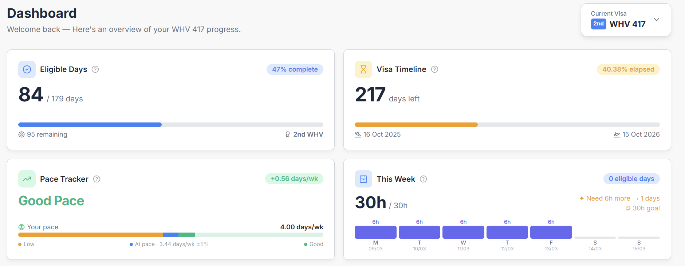
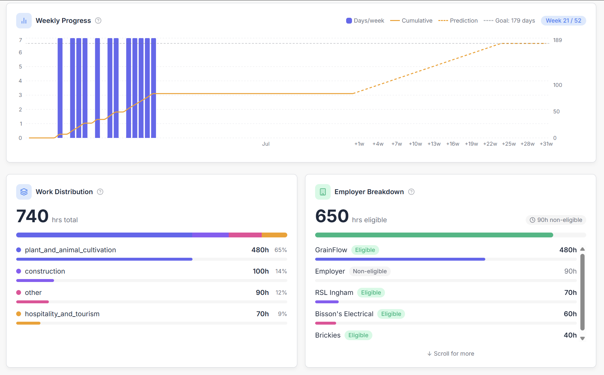
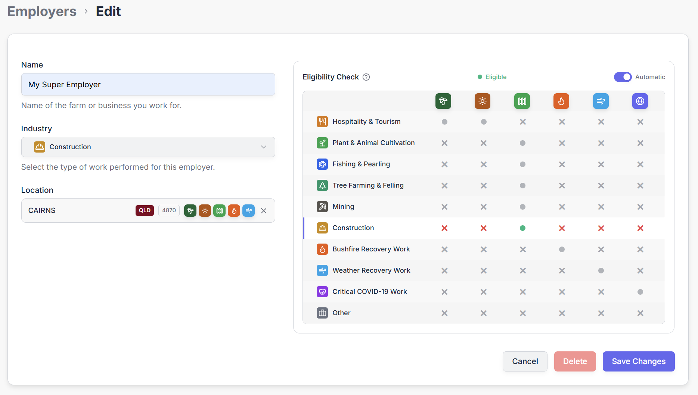
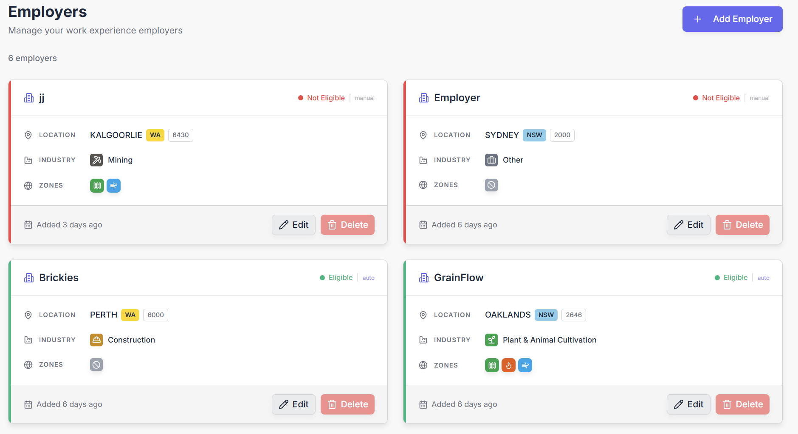
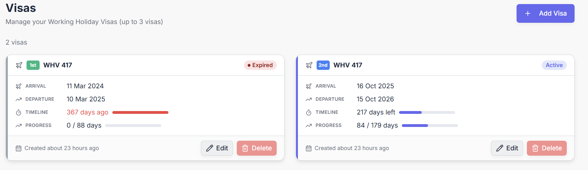

# GET GRANTED 417

A full-stack web application that helps **Working Holiday Visa (subclass 417)** holders in Australia track their specified work, manage employers, and know exactly where they stand toward earning their next visa.

- 📋 **Work Tracking** — Log hours per employer per day, auto-converted to eligible days using official WHV thresholds
- ✅ **Eligibility Check** — Instantly validates if your employer qualifies by cross-referencing industry, suburb, and geographic zone
- 🏢 **Employer Management** — 10 industry types, automatic or manual eligibility, built-in Australian postcode database
- 🪪 **Multi-Visa Support** — Track 1st, 2nd, and 3rd WHV visas independently with their own timeline and progress
- 📊 **Dashboard** — Real-time progress, pace tracker, weekly/monthly charts, work distribution breakdown

> 🚧 **In development — not yet in production.** Core features are functional, new features are being shipped regularly. The app name is subject to change.

---

## 🛠️ Tech Stack

| Layer | Technology |
|-------|------------|
| **Frontend** |         |
| **Backend** |     |
| **Shared** |  TypeScript types, business rule constants |
| **Database** |  |
| **Infrastructure** |   |
| **Monorepo** |  workspaces |

---

## 📸 Preview

<table>
  <tr>
    <td align="center"><strong>📊 Dashboard — Stats</strong></td>
    <td align="center"><strong>📈 Dashboard — Charts</strong></td>
  </tr>
  <tr>
    <td><a href=".github/assets/dashboard-stats.png"></a></td>
    <td><a href=".github/assets/dashboard-charts.png"></a></td>
  </tr>
  <tr>
    <td align="center"><strong>✅ Eligibility Check</strong></td>
    <td align="center"><strong>🏢 Employers</strong></td>
  </tr>
  <tr>
    <td><a href=".github/assets/employer-form.png"></a></td>
    <td><a href=".github/assets/employers.png"></a></td>
  </tr>
  <tr>
    <td align="center" colspan="2"><strong>🪪 Visas</strong></td>
  </tr>
  <tr>
    <td colspan="2"><a href=".github/assets/visas.png"></a></td>
  </tr>
</table>

---

## 🔜 Upcoming Features

| Feature | Description |
|---------|-------------|
| 📄 **Data Export for Visa Application** | Export your work history in a format ready to attach to your WHV visa application (Immigration form support) |
| ⏱️ **New Hour Entry System** | Redesigned, faster way to log your daily work hours |
| 🗺️ **Interactive Australia Map** | Visual map tool to explore eligible zones by industry — see at a glance where your work counts |
| 🔍 **Suburb Search Table** | Searchable directory of suburbs with high work availability — find your next eligible job location |
| 🌙 **Dark Mode** | Full dark theme support across the entire application |

---

## 🏗️ Architecture

```
get-granted-417/
├── client/          # React SPA — UI, routing, state management
├── server/          # NestJS API — auth, business logic, data access
├── shared/          # Zod schemas, TypeScript types, WHV constants
└── pnpm-workspace.yaml
```

- **Prisma** → source of truth for the database schema (migrations, relations)
- **Zod** (in `/shared`) → source of truth for API contracts (validation, DTOs)
- NestJS services handle the mapping between database models and API types
- The client communicates exclusively through REST API calls (never direct DB access)
- JWT authentication with access/refresh token rotation

---

## 🚀 Getting Started

### Prerequisites

- Node.js >= 20
- pnpm >= 9
- PostgreSQL instance

### Setup

```bash
# Install dependencies
pnpm install

# Build the shared package
pnpm build:shared

# Run database migrations
pnpm --filter server prisma:migrate

# Start development servers
pnpm dev:client    # React frontend (Vite)
pnpm dev:server    # NestJS backend (watch mode)
```

### Environment Variables

Copy the example env files and fill in your values:

```bash
cp client/.env.example client/.env
cp server/.env.example server/.env
```

## 📜 Scripts

```bash
# Development
pnpm dev:client                        # Start React dev server
pnpm dev:server                        # Start NestJS in watch mode

# Build
pnpm build:client                      # Build React app
pnpm build:server                      # Build NestJS app
pnpm build:shared                      # Build shared package

# Test
pnpm test                              # Run all tests

# Lint
pnpm lint                              # Lint all packages

# Database
pnpm --filter server prisma:generate   # Generate Prisma client
pnpm --filter server prisma:migrate    # Run migrations
pnpm --filter server prisma:studio     # Open Prisma Studio
```

---

## ⚠️ Disclaimer

This project is **not affiliated with, endorsed by, or connected to** the Australian Government or the Department of Home Affairs. Always refer to the official source for visa requirements and eligibility rules: [immi.homeaffairs.gov.au](https://immi.homeaffairs.gov.au/).

## 📝 License

This project is **source-available** under a non-commercial license. You are free to view, fork, modify, and redistribute the code — as long as it remains **non-commercial** with attribution.

The database content (Australian postcode/suburb data) and the data collection pipeline (scraping from multiple sources) are **kept private** and not included in this repository.

See [LICENSE](LICENSE) for details.

---

## 🤖 AI Usage

In the interest of transparency: AI is used regularly throughout this project as a development tool — for code generation, refactoring, debugging, and documentation. But it remains exactly that: a tool. As the sole developer, I define the architecture, enforce best practices, and maintain full control over technical direction. AI accelerates execution — it doesn't replace thinking.

---

## 👤 Author

<table>
  <tr>
    <td align="center">
      <strong>Thibault Hervé</strong><br/>
      Full-Stack Developer<br/>
        <br/><br/>
      <a href="https://www.linkedin.com/in/thibaultherve8/"></a>
      <a href="https://github.com/thibaultherve"></a>
    </td>
  </tr>
</table>
