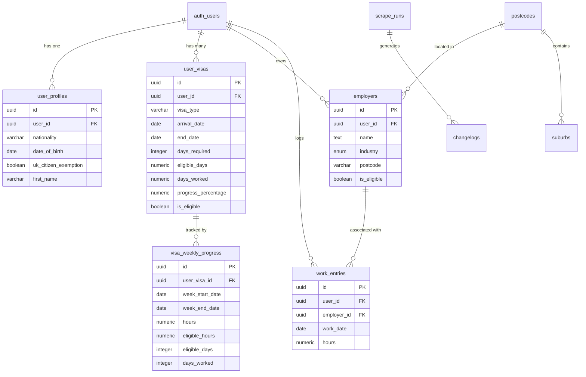
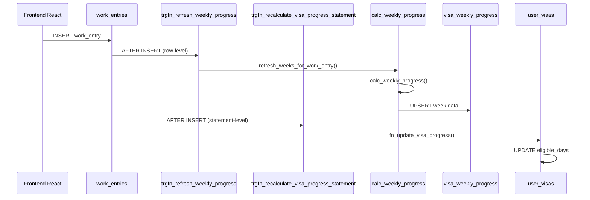
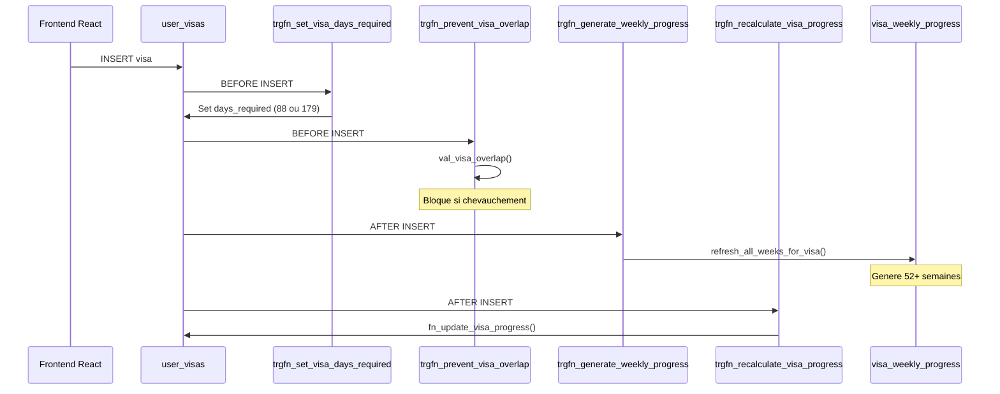
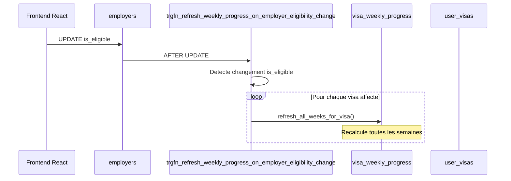

  # Supabase Backend Documentation

> Documentation complete des fonctions PostgreSQL et triggers pour GET GRANTED 417
> Generated: 2026-01-12 | Updated: 2026-01-12 (fix critical bugs + cleanup)

## Table of Contents

- [Vue d'ensemble](#vue-densemble)
- [Architecture des donnees](#architecture-des-donnees)
- [Organigramme des Triggers](#organigramme-des-triggers)
- [Flux de donnees](#flux-de-donnees)
- [Liste des Fonctions](#liste-des-fonctions)
  - [Fonctions Trigger (trgfn_*)](#fonctions-trigger-trgfn_)
  - [Fonctions de Calcul (calc_*)](#fonctions-de-calcul-calc_)
  - [Fonctions de Refresh (refresh_*)](#fonctions-de-refresh-refresh_)
  - [Fonctions de Recuperation (fn_*)](#fonctions-de-recuperation-fn_)
  - [Fonctions de Validation (val_*)](#fonctions-de-validation-val_)
  - [Fonctions Utilitaires (util_*)](#fonctions-utilitaires-util_)
- [Liste des Triggers](#liste-des-triggers)
- [Code Source Complet](#code-source-complet)

---

## Vue d'ensemble

### Statistiques

| Categorie | Nombre |
|-----------|--------|
| Tables principales | 9 |
| Fonctions custom | 18 |
| Triggers actifs | 17 |
| Appels RPC depuis React | 0 |

### Mode d'operation

**Toutes les fonctions sont appelees automatiquement par les triggers** lorsque des donnees sont modifiees. Le frontend React n'appelle aucune fonction directement via `.rpc()` - il utilise uniquement des requetes directes sur les tables (select, insert, update, delete).

---

## Architecture des donnees



---

## Organigramme des Triggers

### Vue globale des triggers par table

```mermaid
flowchart TB
    subgraph EMPLOYERS["Table: employers"]
        E_INSERT[INSERT]
        E_UPDATE[UPDATE]
    end

    subgraph USER_VISAS["Table: user_visas"]
        V_INSERT[INSERT]
        V_UPDATE[UPDATE]
    end

    subgraph WORK_ENTRIES["Table: work_entries"]
        W_INSERT[INSERT]
        W_UPDATE[UPDATE]
        W_DELETE[DELETE]
    end

    subgraph USER_PROFILES["Table: user_profiles"]
        P_UPDATE[UPDATE]
    end

    subgraph TRIGGER_FUNCTIONS["Trigger Functions"]
        TRG_SET_USER[trgfn_set_user_id]
        TRG_TIMESTAMP[trgfn_update_timestamp]
        TRG_VISA_DAYS[trgfn_set_visa_days_required]
        TRG_PREVENT_OVERLAP[trgfn_prevent_visa_overlap]
        TRG_GENERATE_WEEKS[trgfn_generate_weekly_progress_on_visa_insert]
        TRG_CALC_PROGRESS[trgfn_recalculate_visa_progress]
        TRG_REFRESH_EMPLOYER[trgfn_refresh_weekly_progress_on_employer_eligibility_change]
        TRG_REFRESH_WORK[trgfn_refresh_weekly_progress_on_work_entry_change]
        TRG_RECALC_STMT[trgfn_recalculate_visa_progress_statement]
        TRG_VISA_TIMESTAMP[trgfn_update_visa_timestamp_conditional]
    end

    E_INSERT --> TRG_SET_USER
    E_UPDATE --> TRG_TIMESTAMP
    E_UPDATE --> TRG_REFRESH_EMPLOYER

    V_INSERT --> TRG_VISA_DAYS
    V_INSERT --> TRG_PREVENT_OVERLAP
    V_INSERT --> TRG_GENERATE_WEEKS
    V_INSERT --> TRG_CALC_PROGRESS
    V_UPDATE --> TRG_PREVENT_OVERLAP
    V_UPDATE --> TRG_VISA_TIMESTAMP

    W_INSERT --> TRG_REFRESH_WORK
    W_INSERT --> TRG_RECALC_STMT
    W_UPDATE --> TRG_TIMESTAMP
    W_UPDATE --> TRG_RECALC_STMT
    W_DELETE --> TRG_RECALC_STMT

    P_UPDATE --> TRG_TIMESTAMP
```



---

## Flux de donnees

### Flux lors de l'ajout d'heures de travail



### Flux lors de la creation d'un visa



### Flux lors du changement d'eligibilite d'un employeur



---

## Liste des Fonctions

### Classification par mode d'appel

| Appelees par | Fonctions |
|--------------|-----------|
| **Triggers (automatique)** | Toutes les `trgfn_*`, `calc_*`, `refresh_*`, `fn_update_*` |
| **Frontend React (.rpc)** | Aucune |
| **Autres fonctions internes** | `val_*`, `calc_*` |

---

### Fonctions Trigger (trgfn_*)

Ces fonctions sont executees automatiquement par les triggers PostgreSQL.

#### trgfn_set_user_id

| Propriete | Valeur |
|-----------|--------|
| **Declencheur** | BEFORE INSERT on `employers` |
| **Objectif** | Definit automatiquement `user_id` depuis `auth.uid()` |
| **Retour** | trigger |

**Description detaillee:**
- Verifie si `NEW.user_id` est NULL
- Si oui, assigne `auth.uid()` (l'utilisateur connecte)
- Permet d'inserer sans specifier explicitement le user_id

---

#### trgfn_update_timestamp

| Propriete | Valeur |
|-----------|--------|
| **Declencheur** | BEFORE UPDATE on `employers`, `user_profiles`, `work_entries` |
| **Objectif** | Met a jour automatiquement `updated_at` |
| **Retour** | trigger |

**Description detaillee:**
- Fonction generique utilisable sur n'importe quelle table avec `updated_at`
- Assigne `NOW()` a `NEW.updated_at`

---

#### trgfn_set_visa_days_required

| Propriete | Valeur |
|-----------|--------|
| **Declencheur** | BEFORE INSERT on `user_visas` |
| **Objectif** | Definit `days_required` selon le type de visa |
| **Retour** | trigger |
| **Dependance** | `get_days_required_for_visa_type()` |

**Description detaillee:**
Utilise la fonction centralisee `get_days_required_for_visa_type()`:
- `first_whv` → 88 jours (pour obtenir le 2nd WHV)
- `second_whv` → 179 jours (pour obtenir le 3rd WHV)
- `third_whv` → 0 jours (pas de progression possible)
- Met aussi a jour `updated_at`

---

#### trgfn_prevent_visa_overlap

| Propriete | Valeur |
|-----------|--------|
| **Declencheur** | BEFORE INSERT/UPDATE on `user_visas` |
| **Objectif** | Empeche les periodes de visa qui se chevauchent |
| **Retour** | trigger |
| **Dependance** | `val_visa_overlap()` |

**Description detaillee:**
- Appelle `val_visa_overlap()` pour detecter les conflits
- Leve une EXCEPTION avec message detaille si chevauchement detecte
- Message inclut: date de debut, type de visa existant, dates du visa existant

---

#### trgfn_generate_weekly_progress_on_visa_insert

| Propriete | Valeur |
|-----------|--------|
| **Declencheur** | AFTER INSERT on `user_visas` |
| **Objectif** | Genere toutes les semaines de suivi pour un nouveau visa |
| **Retour** | trigger |
| **Dependance** | `refresh_all_weeks_for_visa()` |

**Description detaillee:**
- Cree 52+ enregistrements dans `visa_weekly_progress`
- Couvre toute la duree du visa (arrival_date → end_date)
- Permet le suivi hebdomadaire immediat

---

#### trgfn_recalculate_visa_progress

| Propriete | Valeur |
|-----------|--------|
| **Declencheur** | AFTER INSERT on `user_visas` |
| **Objectif** | Calcule `eligible_days` pour les work_entries existantes |
| **Retour** | trigger |
| **Dependance** | `fn_update_visa_progress()` |

**Description detaillee:**
- Utile quand un visa est cree apres avoir deja enregistre des heures
- Retroactivement comptabilise les heures dans la nouvelle periode visa

---

#### trgfn_recalculate_visa_progress_statement

| Propriete | Valeur |
|-----------|--------|
| **Declencheur** | AFTER INSERT/UPDATE/DELETE on `work_entries` (statement-level) |
| **Objectif** | Recalcule le progres visa une seule fois par statement SQL |
| **Retour** | trigger |
| **Dependance** | `fn_update_visa_progress()` |

**Description detaillee:**
- Trigger de niveau STATEMENT (pas ROW)
- Utilise les transition tables `new_table` et `old_table`
- Plus efficace que row-level pour les operations bulk
- Gere INSERT, UPDATE et DELETE

---

#### trgfn_refresh_weekly_progress_on_employer_eligibility_change

| Propriete | Valeur |
|-----------|--------|
| **Declencheur** | AFTER UPDATE on `employers` |
| **Objectif** | Recalcule les semaines quand l'eligibilite d'un employeur change |
| **Retour** | trigger |
| **Dependance** | `refresh_all_weeks_for_visa()` |

**Description detaillee:**
- Detecte si `is_eligible` a change (`OLD.is_eligible IS DISTINCT FROM NEW.is_eligible`)
- Trouve tous les visas avec des work_entries pour cet employeur
- Recalcule TOUTES les semaines de chaque visa affecte
- Impact potentiellement lourd si l'employeur a beaucoup d'heures

---

#### trgfn_refresh_weekly_progress_on_work_entry_change

| Propriete | Valeur |
|-----------|--------|
| **Declencheur** | AFTER INSERT/UPDATE/DELETE on `work_entries` |
| **Objectif** | Met a jour la semaine concernee apres modification d'heures |
| **Retour** | trigger |
| **Dependance** | `refresh_weeks_for_work_entry()` |

**Description detaillee:**
- INSERT: Rafraichit la semaine de la nouvelle entree
- UPDATE: Si `work_date` change, rafraichit les deux semaines (ancienne et nouvelle)
- DELETE: Rafraichit la semaine de l'entree supprimee

---

#### trgfn_update_visa_timestamp_conditional

| Propriete | Valeur |
|-----------|--------|
| **Declencheur** | BEFORE UPDATE on `user_visas` |
| **Objectif** | Met a jour `updated_at` seulement si le progres change |
| **Retour** | trigger |

**Description detaillee:**
- Evite les updates inutiles de timestamp
- Condition: `eligible_days` OU `days_worked` doit avoir change
- Optimisation pour les queries basees sur `updated_at`

---

### Fonctions de Calcul (calc_*)

Ces fonctions effectuent les calculs metier WHV 417.

#### calc_visa_progress

| Propriete | Valeur |
|-----------|--------|
| **Parametres** | `target_visa_id UUID` |
| **Retour** | TABLE(visa_id, visa_type, arrival_date, end_date, hours, eligible_hours, eligible_days, days_required, progress_percentage, **total_days_worked**) |
| **Securite** | SECURITY DEFINER |
| **Appelant** | `fn_update_visa_progress()` |
| **Dependance** | `get_days_required_for_visa_type()` |

**Description detaillee:**
Calcule le progres complet d'un visa en distinguant:
- **hours**: Total des heures (tous employeurs)
- **eligible_hours**: Heures avec employeurs eligibles uniquement
- **eligible_days**: Jours eligibles selon les seuils WHV 417
- **total_days_worked**: Jours calendaires distincts travailles (tous employeurs)

**Regles de calcul des jours eligibles par semaine:**
| Heures/semaine | Jours comptabilises |
|----------------|---------------------|
| 30+ | 7 jours |
| 24-29.99 | 4 jours |
| 18-23.99 | 3 jours |
| 12-17.99 | 2 jours |
| 6-11.99 | 1 jour |
| < 6 | 0 jour |

**Note:** Utilise `get_days_required_for_visa_type()` pour la coherence du calcul `days_required`.

---

#### calc_weekly_progress

| Propriete | Valeur |
|-----------|--------|
| **Parametres** | `target_visa_id UUID`, `target_week_start DATE` |
| **Retour** | TABLE(user_visa_id, week_start_date, week_end_date, hours, eligible_hours, eligible_days, days_worked) |
| **Securite** | SECURITY DEFINER |
| **Appelant** | `refresh_all_weeks_for_visa()`, `refresh_weeks_for_work_entry()` |

**Description detaillee:**
Calcule les metriques d'une semaine specifique:
- Gere les semaines partielles (debut/fin de visa)
- Calcule `days_worked` = nombre de jours distincts travailles
- Respecte les limites du visa (ne compte pas hors periode)

---

### Fonctions de Refresh (refresh_*)

Ces fonctions regenerent les donnees de suivi.

#### refresh_all_weeks_for_visa

| Propriete | Valeur |
|-----------|--------|
| **Parametres** | `target_visa_id UUID` |
| **Retour** | void |
| **Securite** | SECURITY DEFINER |
| **Appelant** | `trgfn_generate_weekly_progress_on_visa_insert()`, `trgfn_refresh_weekly_progress_on_employer_eligibility_change()` |

**Description detaillee:**
1. Supprime TOUS les enregistrements existants pour ce visa
2. Trouve le lundi de la semaine d'arrivee
3. Boucle semaine par semaine jusqu'a `end_date`
4. Appelle `calc_weekly_progress()` pour chaque semaine
5. Insere les resultats dans `visa_weekly_progress`

**Performance:** Cree ~52 enregistrements par visa

---

#### refresh_weeks_for_work_entry

| Propriete | Valeur |
|-----------|--------|
| **Parametres** | `target_user_id UUID`, `target_work_date DATE` |
| **Retour** | void |
| **Securite** | SECURITY DEFINER |
| **Appelant** | `trgfn_refresh_weekly_progress_on_work_entry_change()` |

**Description detaillee:**
1. Calcule le lundi de la semaine de `target_work_date`
2. Trouve tous les visas couvrant cette date
3. Pour chaque visa: calcule et UPSERT la semaine
4. Utilise ON CONFLICT pour update si existe deja

**Performance:** Met a jour 1-N semaines (generalement 1)

---

### Fonctions de Recuperation (fn_*)

Ces fonctions retournent des donnees formatees.

#### fn_update_visa_progress

| Propriete | Valeur |
|-----------|--------|
| **Parametres** | `target_user_id UUID` |
| **Retour** | void |
| **Securite** | SECURITY DEFINER |
| **Appelant** | `trgfn_recalculate_visa_progress()`, `trgfn_recalculate_visa_progress_statement()` |

**Description detaillee:**
1. Boucle sur tous les visas de l'utilisateur
2. Appelle `calc_visa_progress()` pour chaque visa
3. Met a jour dans `user_visas`:
   - `eligible_days` = jours calcules selon regles WHV 417
   - `days_worked` = jours calendaires distincts travailles (tous employeurs)
4. Fonction centrale pour la mise a jour du progres

---

### Fonctions de Validation (val_*)

Ces fonctions valident les regles metier WHV 417.

#### val_visa_overlap

| Propriete | Valeur |
|-----------|--------|
| **Parametres** | `p_user_id UUID`, `p_arrival_date DATE`, `p_visa_id UUID DEFAULT NULL` |
| **Retour** | TABLE(overlapping_visa_id, overlapping_visa_type, overlapping_arrival_date, overlapping_end_date) |
| **Appelant** | `trgfn_prevent_visa_overlap()` |

**Description detaillee:**
- Detecte les chevauchements de periodes visa
- `p_visa_id` permet d'exclure le visa actuel (pour UPDATE)
- Retourne les details du visa en conflit si trouve
- Verifie que les periodes ne se touchent pas (gap requis)

---

#### val_whv417_nationality

| Propriete | Valeur |
|-----------|--------|
| **Parametres** | `country_code VARCHAR` |
| **Retour** | BOOLEAN |
| **Appelant** | Non utilise actuellement |

**Description detaillee:**
Valide si un pays est eligible au WHV 417 (2025):
- BE, CY, DK, EE, FI, FR, DE, IE, IT, MT, NL, NO, SE (Europe)
- GB (Royaume-Uni)
- HK, JP, KR, TW (Asie)
- CA (Canada)

---

### Fonctions Utilitaires

#### get_days_required_for_visa_type

| Propriete | Valeur |
|-----------|--------|
| **Parametres** | `p_visa_type VARCHAR` |
| **Retour** | INTEGER |
| **Securite** | IMMUTABLE |
| **Appelant** | `trgfn_set_visa_days_required()`, `calc_visa_progress()` |

**Description detaillee:**
Fonction centralisee retournant le nombre de jours requis selon le type de visa WHV 417:
- `first_whv` → 88 jours (pour obtenir le 2nd WHV)
- `second_whv` → 179 jours (pour obtenir le 3rd WHV)
- `third_whv` → 0 jours (pas de progression possible)

**Pourquoi cette fonction:**
- Evite la duplication de la logique `days_required`
- Garantit la coherence entre triggers et fonctions de calcul
- Marquee `IMMUTABLE` pour optimisation des performances

---

## Liste des Triggers

### Table: employers

| Trigger | Timing | Event | Function |
|---------|--------|-------|----------|
| trg_employers_set_user_id | BEFORE | INSERT | trgfn_set_user_id |
| trg_employers_update_timestamp | BEFORE | UPDATE | trgfn_update_timestamp |
| trg_refresh_weekly_progress_on_employer_eligibility_change | AFTER | UPDATE | trgfn_refresh_weekly_progress_on_employer_eligibility_change |

### Table: user_profiles

| Trigger | Timing | Event | Function |
|---------|--------|-------|----------|
| trg_user_profiles_update_timestamp | BEFORE | UPDATE | trgfn_update_timestamp |

### Table: user_visas

| Trigger | Timing | Event | Function |
|---------|--------|-------|----------|
| trg_user_visas_set_days_required | BEFORE | INSERT | trgfn_set_visa_days_required |
| trg_user_visas_prevent_overlap_insert | BEFORE | INSERT | trgfn_prevent_visa_overlap |
| trg_user_visas_prevent_overlap_update | BEFORE | UPDATE | trgfn_prevent_visa_overlap |
| trg_generate_weekly_progress_on_visa_insert | AFTER | INSERT | trgfn_generate_weekly_progress_on_visa_insert |
| trg_user_visas_calculate_progress | AFTER | INSERT | trgfn_recalculate_visa_progress |
| trg_user_visas_update_timestamp_conditional | BEFORE | UPDATE | trgfn_update_visa_timestamp_conditional |

### Table: work_entries

| Trigger | Timing | Event | Level | Function |
|---------|--------|-------|-------|----------|
| trg_refresh_weekly_progress_on_work_entry_change | AFTER | INSERT | ROW | trgfn_refresh_weekly_progress_on_work_entry_change |
| trg_refresh_weekly_progress_on_work_entry_update | AFTER | UPDATE | ROW | trgfn_refresh_weekly_progress_on_work_entry_change |
| trg_refresh_weekly_progress_on_work_entry_delete | AFTER | DELETE | ROW | trgfn_refresh_weekly_progress_on_work_entry_change |
| trg_work_entries_update_timestamp | BEFORE | UPDATE | ROW | trgfn_update_timestamp |
| trg_work_entries_recalc_progress_insert | AFTER | INSERT | STATEMENT | trgfn_recalculate_visa_progress_statement |
| trg_work_entries_recalc_progress_update | AFTER | UPDATE | STATEMENT | trgfn_recalculate_visa_progress_statement |
| trg_work_entries_recalc_progress_delete | AFTER | DELETE | STATEMENT | trgfn_recalculate_visa_progress_statement |

---

## Code Source Complet

### trgfn_set_user_id

```sql
CREATE OR REPLACE FUNCTION public.trgfn_set_user_id()
 RETURNS trigger
 LANGUAGE plpgsql
AS $function$
BEGIN
  -- Only set user_id if it's not already provided
  IF NEW.user_id IS NULL THEN
    NEW.user_id = auth.uid();
  END IF;
  RETURN NEW;
END;
$function$
```

### trgfn_update_timestamp

```sql
CREATE OR REPLACE FUNCTION public.trgfn_update_timestamp()
 RETURNS trigger
 LANGUAGE plpgsql
AS $function$
BEGIN
  NEW.updated_at = NOW();
  RETURN NEW;
END;
$function$
```

### trgfn_set_visa_days_required

```sql
CREATE OR REPLACE FUNCTION public.trgfn_set_visa_days_required()
 RETURNS trigger
 LANGUAGE plpgsql
AS $function$
BEGIN
  -- Use centralized function for consistency
  NEW.days_required := get_days_required_for_visa_type(NEW.visa_type);
  NEW.updated_at := NOW();
  RETURN NEW;
END;
$function$
```

### trgfn_prevent_visa_overlap

```sql
CREATE OR REPLACE FUNCTION public.trgfn_prevent_visa_overlap()
 RETURNS trigger
 LANGUAGE plpgsql
AS $function$
DECLARE
  overlap_record RECORD;
BEGIN
  -- Check for overlaps using renamed validation function
  FOR overlap_record IN
    SELECT * FROM val_visa_overlap(
      NEW.user_id,
      NEW.arrival_date,
      CASE WHEN TG_OP = 'UPDATE' THEN NEW.id ELSE NULL END
    )
  LOOP
    RAISE EXCEPTION 'Cannot create visa: Your new visa would start on % but you have an existing % visa from % to %. The new visa must start after %.',
      NEW.arrival_date,
      overlap_record.overlapping_visa_type,
      overlap_record.overlapping_arrival_date,
      overlap_record.overlapping_end_date,
      overlap_record.overlapping_end_date;
  END LOOP;

  RETURN NEW;
END;
$function$
```

### trgfn_generate_weekly_progress_on_visa_insert

```sql
CREATE OR REPLACE FUNCTION public.trgfn_generate_weekly_progress_on_visa_insert()
 RETURNS trigger
 LANGUAGE plpgsql
AS $function$
BEGIN
  -- Generate all weekly progress records for the new visa
  PERFORM refresh_all_weeks_for_visa(NEW.id);

  RETURN NEW;
END;
$function$
```

### trgfn_recalculate_visa_progress

```sql
CREATE OR REPLACE FUNCTION public.trgfn_recalculate_visa_progress()
 RETURNS trigger
 LANGUAGE plpgsql
AS $function$
BEGIN
  -- Recalculate progress for the newly created visa's user
  -- This will process any existing work_entries that fall within the visa dates
  PERFORM fn_update_visa_progress(NEW.user_id);

  RETURN NEW;
END;
$function$
```

### trgfn_recalculate_visa_progress_statement

```sql
CREATE OR REPLACE FUNCTION public.trgfn_recalculate_visa_progress_statement()
 RETURNS trigger
 LANGUAGE plpgsql
AS $function$
DECLARE
  affected_user_id UUID;
BEGIN
  -- For statement-level triggers, we need to use transition tables
  -- to get all affected user_ids at once

  -- Handle INSERT and UPDATE (NEW rows exist)
  IF TG_OP IN ('INSERT', 'UPDATE') THEN
    -- Get unique user_ids from the modified rows and update their visas
    FOR affected_user_id IN
      SELECT DISTINCT user_id FROM new_table
    LOOP
      PERFORM fn_update_visa_progress(affected_user_id);
    END LOOP;
  END IF;

  -- Handle DELETE (OLD rows exist)
  IF TG_OP = 'DELETE' THEN
    -- Get unique user_ids from the deleted rows and update their visas
    FOR affected_user_id IN
      SELECT DISTINCT user_id FROM old_table
    LOOP
      PERFORM fn_update_visa_progress(affected_user_id);
    END LOOP;
  END IF;

  -- For UPDATE, also check if user_id changed (edge case)
  IF TG_OP = 'UPDATE' THEN
    -- Get user_ids that might have been changed FROM old rows
    FOR affected_user_id IN
      SELECT DISTINCT user_id FROM old_table
      WHERE user_id NOT IN (SELECT user_id FROM new_table)
    LOOP
      PERFORM fn_update_visa_progress(affected_user_id);
    END LOOP;
  END IF;

  RETURN NULL;
END;
$function$
```

### trgfn_refresh_weekly_progress_on_employer_eligibility_change

```sql
CREATE OR REPLACE FUNCTION public.trgfn_refresh_weekly_progress_on_employer_eligibility_change()
 RETURNS trigger
 LANGUAGE plpgsql
AS $function$
BEGIN
  -- Only act if is_eligible actually changed
  IF OLD.is_eligible IS DISTINCT FROM NEW.is_eligible THEN

    -- Recalculate all weeks for all visas that have work_entries with this employer
    DECLARE
      affected_visa_id UUID;
    BEGIN
      FOR affected_visa_id IN
        SELECT DISTINCT uv.id
        FROM user_visas uv
        JOIN work_entries we ON we.user_id = uv.user_id
        WHERE we.employer_id = NEW.id
          AND we.work_date >= uv.arrival_date
          AND we.work_date <= uv.end_date
      LOOP
        -- Recalculate all weeks for this visa
        PERFORM refresh_all_weeks_for_visa(affected_visa_id);
      END LOOP;
    END;

  END IF;

  RETURN NEW;
END;
$function$
```

### trgfn_refresh_weekly_progress_on_work_entry_change

```sql
CREATE OR REPLACE FUNCTION public.trgfn_refresh_weekly_progress_on_work_entry_change()
 RETURNS trigger
 LANGUAGE plpgsql
AS $function$
BEGIN
  IF TG_OP = 'INSERT' THEN
    -- Refresh the week for the new work entry
    PERFORM refresh_weeks_for_work_entry(NEW.user_id, NEW.work_date);

  ELSIF TG_OP = 'UPDATE' THEN
    -- If work_date changed, refresh both old and new weeks
    IF OLD.work_date <> NEW.work_date THEN
      PERFORM refresh_weeks_for_work_entry(OLD.user_id, OLD.work_date);
      PERFORM refresh_weeks_for_work_entry(NEW.user_id, NEW.work_date);
    ELSE
      -- Just refresh the current week (hours or employer_id changed)
      PERFORM refresh_weeks_for_work_entry(NEW.user_id, NEW.work_date);
    END IF;

  ELSIF TG_OP = 'DELETE' THEN
    -- Refresh the week for the deleted work entry
    PERFORM refresh_weeks_for_work_entry(OLD.user_id, OLD.work_date);
  END IF;

  RETURN NULL;
END;
$function$
```

### trgfn_update_visa_timestamp_conditional

```sql
CREATE OR REPLACE FUNCTION public.trgfn_update_visa_timestamp_conditional()
 RETURNS trigger
 LANGUAGE plpgsql
AS $function$
BEGIN
  -- Only update if eligible_days or days_worked changed
  IF OLD.eligible_days IS DISTINCT FROM NEW.eligible_days OR
     OLD.days_worked IS DISTINCT FROM NEW.days_worked THEN
    NEW.updated_at = NOW();
  END IF;
  RETURN NEW;
END;
$function$
```

### calc_visa_progress

```sql
CREATE OR REPLACE FUNCTION public.calc_visa_progress(target_visa_id uuid)
 RETURNS TABLE(
   visa_id uuid,
   visa_type character varying,
   arrival_date date,
   end_date date,
   hours numeric,
   eligible_hours numeric,
   eligible_days integer,
   days_required integer,
   progress_percentage numeric,
   total_days_worked integer
 )
 LANGUAGE plpgsql
 SECURITY DEFINER
AS $function$
DECLARE
    visa_rec RECORD;
    total_hours NUMERIC := 0.00;
    total_eligible_hours NUMERIC := 0.00;
    total_eligible_days INTEGER := 0;
    days_req INTEGER;
    progress_pct NUMERIC;
    distinct_days_worked INTEGER := 0;
BEGIN
    -- Get visa details
    SELECT uv.* INTO visa_rec FROM user_visas uv WHERE uv.id = target_visa_id;

    IF NOT FOUND THEN
        RETURN;
    END IF;

    -- Calculate total hours (all employers)
    SELECT COALESCE(SUM(weekly_data.hours), 0.00)
    INTO total_hours
    FROM (
        SELECT DATE_TRUNC('week', we.work_date) as week_start, SUM(we.hours) as hours
        FROM work_entries we
        WHERE we.user_id = visa_rec.user_id
            AND we.work_date >= visa_rec.arrival_date
            AND we.work_date <= visa_rec.end_date
        GROUP BY DATE_TRUNC('week', we.work_date)
    ) weekly_data;

    -- Calculate eligible hours and eligible days using WHV 417 rules (by week)
    SELECT
        COALESCE(SUM(weekly_data.hours), 0.00),
        COALESCE(SUM(
            CASE
                WHEN weekly_data.hours >= 30 THEN 7
                WHEN weekly_data.hours >= 24 THEN 4
                WHEN weekly_data.hours >= 18 THEN 3
                WHEN weekly_data.hours >= 12 THEN 2
                WHEN weekly_data.hours >= 6 THEN 1
                ELSE 0
            END
        ), 0)
    INTO total_eligible_hours, total_eligible_days
    FROM (
        SELECT DATE_TRUNC('week', we.work_date) as week_start, SUM(we.hours) as hours
        FROM work_entries we
        JOIN employers e ON we.employer_id = e.id
        WHERE we.user_id = visa_rec.user_id
            AND we.work_date >= visa_rec.arrival_date
            AND we.work_date <= visa_rec.end_date
            AND e.is_eligible = true
        GROUP BY DATE_TRUNC('week', we.work_date)
    ) weekly_data;

    -- Calculate distinct days worked (all employers, not just eligible)
    SELECT COUNT(DISTINCT we.work_date)
    INTO distinct_days_worked
    FROM work_entries we
    WHERE we.user_id = visa_rec.user_id
        AND we.work_date >= visa_rec.arrival_date
        AND we.work_date <= visa_rec.end_date;

    -- Use centralized function for days_required
    days_req := get_days_required_for_visa_type(visa_rec.visa_type);

    -- Calculate progress percentage (allows over 100%)
    IF days_req > 0 THEN
        progress_pct := (total_eligible_days::NUMERIC / days_req) * 100;
    ELSE
        progress_pct := 0;
    END IF;

    -- Return the result
    RETURN QUERY SELECT
        visa_rec.id,
        visa_rec.visa_type,
        visa_rec.arrival_date,
        visa_rec.end_date,
        total_hours,
        total_eligible_hours,
        total_eligible_days,
        days_req,
        progress_pct,
        distinct_days_worked;
END;
$function$
```

### calc_weekly_progress

```sql
CREATE OR REPLACE FUNCTION public.calc_weekly_progress(target_visa_id uuid, target_week_start date)
 RETURNS TABLE(user_visa_id uuid, week_start_date date, week_end_date date, hours numeric, eligible_hours numeric, eligible_days integer, days_worked integer)
 LANGUAGE plpgsql
 SECURITY DEFINER
AS $function$
DECLARE
  visa_rec RECORD;
  week_end DATE;
  calc_start DATE;
  calc_end DATE;
  total_hours NUMERIC := 0.00;
  total_eligible_hours NUMERIC := 0.00;
  calculated_eligible_days INTEGER := 0;
  total_days_worked INTEGER := 0;
BEGIN
  -- Get visa details
  SELECT uv.* INTO visa_rec FROM user_visas uv WHERE uv.id = target_visa_id;

  IF NOT FOUND THEN
    RETURN;
  END IF;

  -- Calculate week end (always Sunday, 6 days after Monday)
  week_end := (target_week_start + INTERVAL '6 days')::DATE;

  -- Determine calculation boundaries (intersection of week and visa period)
  calc_start := GREATEST(target_week_start, visa_rec.arrival_date);
  calc_end := LEAST(week_end, visa_rec.end_date);

  -- Only calculate if the week overlaps with the visa period
  IF calc_start <= calc_end THEN

    -- Calculate total hours (all employers)
    SELECT COALESCE(SUM(we.hours), 0.00)
    INTO total_hours
    FROM work_entries we
    WHERE we.user_id = visa_rec.user_id
      AND we.work_date >= calc_start
      AND we.work_date <= calc_end;

    -- Calculate eligible hours (only eligible employers)
    SELECT COALESCE(SUM(we.hours), 0.00)
    INTO total_eligible_hours
    FROM work_entries we
    JOIN employers e ON we.employer_id = e.id
    WHERE we.user_id = visa_rec.user_id
      AND we.work_date >= calc_start
      AND we.work_date <= calc_end
      AND e.is_eligible = true;

    -- Calculate eligible days based on eligible hours thresholds
    IF total_eligible_hours >= 30 THEN
      calculated_eligible_days := 7;
    ELSIF total_eligible_hours >= 24 THEN
      calculated_eligible_days := 4;
    ELSIF total_eligible_hours >= 18 THEN
      calculated_eligible_days := 3;
    ELSIF total_eligible_hours >= 12 THEN
      calculated_eligible_days := 2;
    ELSIF total_eligible_hours >= 6 THEN
      calculated_eligible_days := 1;
    ELSE
      calculated_eligible_days := 0;
    END IF;

    -- Calculate distinct days worked (all employers)
    SELECT COUNT(DISTINCT we.work_date)
    INTO total_days_worked
    FROM work_entries we
    WHERE we.user_id = visa_rec.user_id
      AND we.work_date >= calc_start
      AND we.work_date <= calc_end;

  END IF;

  -- Return the calculated values
  RETURN QUERY SELECT
    target_visa_id,
    target_week_start,
    week_end,
    total_hours,
    total_eligible_hours,
    calculated_eligible_days,
    total_days_worked;

END;
$function$
```

### refresh_all_weeks_for_visa

```sql
CREATE OR REPLACE FUNCTION public.refresh_all_weeks_for_visa(target_visa_id uuid)
 RETURNS void
 LANGUAGE plpgsql
 SECURITY DEFINER
AS $function$
DECLARE
  visa_rec RECORD;
  current_week_start DATE;
  week_data RECORD;
BEGIN
  -- Get visa details
  SELECT uv.* INTO visa_rec FROM user_visas uv WHERE uv.id = target_visa_id;

  IF NOT FOUND THEN
    RETURN;
  END IF;

  -- Find the Monday of the week containing arrival_date
  -- PostgreSQL's date_trunc('week', date) returns Monday by default when datestyle is ISO
  current_week_start := DATE_TRUNC('week', visa_rec.arrival_date)::DATE;

  -- Delete all existing weeks for this visa (we'll recreate them)
  DELETE FROM visa_weekly_progress WHERE user_visa_id = target_visa_id;

  -- Loop through all weeks from arrival to end of visa
  WHILE current_week_start <= visa_rec.end_date LOOP

    -- Calculate this week's data
    SELECT * INTO week_data FROM calc_weekly_progress(target_visa_id, current_week_start);

    -- Insert the week into visa_weekly_progress
    INSERT INTO visa_weekly_progress (
      user_visa_id,
      week_start_date,
      week_end_date,
      hours,
      eligible_hours,
      eligible_days,
      days_worked
    ) VALUES (
      week_data.user_visa_id,
      week_data.week_start_date,
      week_data.week_end_date,
      week_data.hours,
      week_data.eligible_hours,
      week_data.eligible_days,
      week_data.days_worked
    );

    -- Move to next week (Monday + 7 days)
    current_week_start := current_week_start + INTERVAL '7 days';

  END LOOP;

END;
$function$
```

### refresh_weeks_for_work_entry

```sql
CREATE OR REPLACE FUNCTION public.refresh_weeks_for_work_entry(target_user_id uuid, target_work_date date)
 RETURNS void
 LANGUAGE plpgsql
 SECURITY DEFINER
AS $function$
DECLARE
  affected_visa_id UUID;
  week_start DATE;
BEGIN
  -- Calculate the Monday of the week containing the work_date
  -- PostgreSQL's date_trunc('week', date) returns Monday by default when datestyle is ISO
  week_start := DATE_TRUNC('week', target_work_date)::DATE;

  -- Find all visas that cover this work_date
  FOR affected_visa_id IN
    SELECT id
    FROM user_visas
    WHERE user_id = target_user_id
      AND arrival_date <= target_work_date
      AND end_date >= target_work_date
  LOOP
    -- Recalculate this specific week for each affected visa
    DECLARE
      week_data RECORD;
    BEGIN
      -- Calculate the week's data
      SELECT * INTO week_data FROM calc_weekly_progress(affected_visa_id, week_start);

      -- Update or insert the week
      INSERT INTO visa_weekly_progress (
        user_visa_id,
        week_start_date,
        week_end_date,
        hours,
        eligible_hours,
        eligible_days,
        days_worked
      ) VALUES (
        week_data.user_visa_id,
        week_data.week_start_date,
        week_data.week_end_date,
        week_data.hours,
        week_data.eligible_hours,
        week_data.eligible_days,
        week_data.days_worked
      )
      ON CONFLICT (user_visa_id, week_start_date)
      DO UPDATE SET
        hours = EXCLUDED.hours,
        eligible_hours = EXCLUDED.eligible_hours,
        eligible_days = EXCLUDED.eligible_days,
        days_worked = EXCLUDED.days_worked,
        updated_at = NOW();
    END;
  END LOOP;
END;
$function$
```

### fn_update_visa_progress

```sql
CREATE OR REPLACE FUNCTION public.fn_update_visa_progress(target_user_id uuid)
 RETURNS void
 LANGUAGE plpgsql
 SECURITY DEFINER
AS $function$
DECLARE
  visa_rec user_visas%ROWTYPE;
  progress_data RECORD;
BEGIN
  -- Update progress for all user's visas
  FOR visa_rec IN SELECT * FROM user_visas WHERE user_id = target_user_id LOOP

    -- Calculate progress for this visa
    SELECT * INTO progress_data FROM calc_visa_progress(visa_rec.id);

    -- Update visa record with correct values
    -- eligible_days = days calculated from WHV 417 rules (based on weekly eligible hours)
    -- days_worked = actual distinct calendar days worked (all employers)
    UPDATE user_visas
    SET
      eligible_days = progress_data.eligible_days,
      days_worked = progress_data.total_days_worked,
      updated_at = NOW()
    WHERE id = visa_rec.id;

  END LOOP;
END;
$function$
```

### val_visa_overlap

```sql
CREATE OR REPLACE FUNCTION public.val_visa_overlap(p_user_id uuid, p_arrival_date date, p_visa_id uuid DEFAULT NULL::uuid)
 RETURNS TABLE(overlapping_visa_id uuid, overlapping_visa_type character varying, overlapping_arrival_date date, overlapping_end_date date)
 LANGUAGE plpgsql
AS $function$
BEGIN
  RETURN QUERY
  SELECT
    v.id,
    v.visa_type,
    v.arrival_date,
    v.end_date
  FROM user_visas v
  WHERE v.user_id = p_user_id
    AND (p_visa_id IS NULL OR v.id != p_visa_id) -- Exclude current visa for updates
    AND (
      -- Check if periods overlap OR touch (we want to prevent both)
      -- New visa starts before or on the same day as existing visa ends
      p_arrival_date <= v.end_date
      AND
      -- New visa ends after or on the same day as existing visa starts
      (p_arrival_date + INTERVAL '1 year')::date >= v.arrival_date
    );
END;
$function$
```

### val_whv417_nationality

```sql
CREATE OR REPLACE FUNCTION public.val_whv417_nationality(country_code character varying)
 RETURNS boolean
 LANGUAGE plpgsql
AS $function$
BEGIN
  -- WHV 417 eligible countries (2025)
  RETURN country_code IN (
    'BE', -- Belgium
    'CY', -- Cyprus
    'DK', -- Denmark
    'EE', -- Estonia
    'FI', -- Finland
    'FR', -- France
    'DE', -- Germany
    'IE', -- Ireland
    'IT', -- Italy
    'MT', -- Malta
    'NL', -- Netherlands
    'NO', -- Norway
    'SE', -- Sweden
    'GB', -- United Kingdom
    'HK', -- Hong Kong SAR
    'JP', -- Japan
    'KR', -- South Korea
    'TW', -- Taiwan
    'CA'  -- Canada
  );
END;
$function$
```

### get_days_required_for_visa_type

```sql
CREATE OR REPLACE FUNCTION public.get_days_required_for_visa_type(p_visa_type VARCHAR)
 RETURNS INTEGER
 LANGUAGE plpgsql
 IMMUTABLE
AS $function$
BEGIN
  -- WHV 417 rules:
  -- first_whv: Need 88 days of specified work to get 2nd WHV
  -- second_whv: Need 179 days of specified work to get 3rd WHV
  -- third_whv: No progression possible (0 days required)
  RETURN CASE p_visa_type
    WHEN 'first_whv' THEN 88
    WHEN 'second_whv' THEN 179
    WHEN 'third_whv' THEN 0
    ELSE 0
  END;
END;
$function$
```
